## Screenshots de algunos flujos

### Login

    
     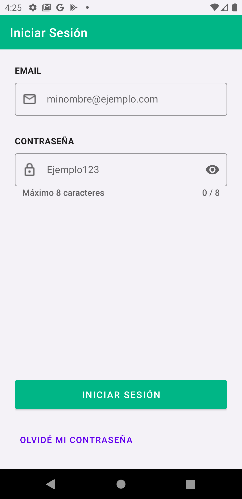
     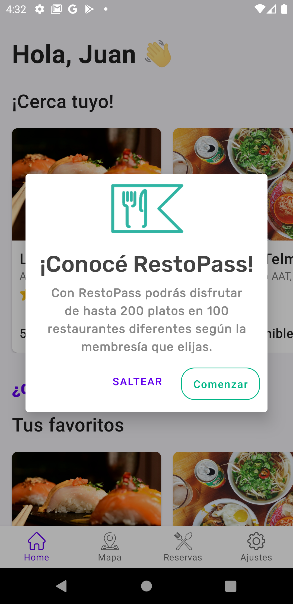

### Home usuario no enrolado

    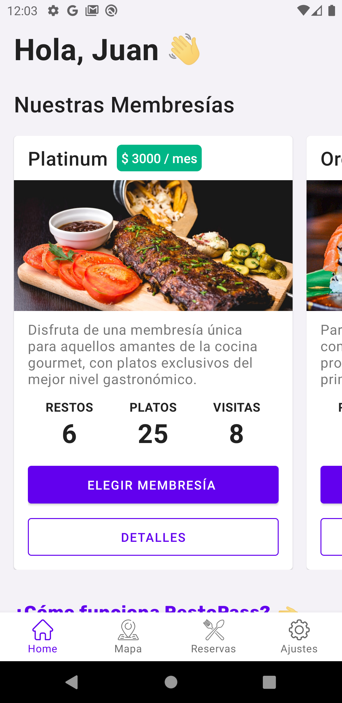
    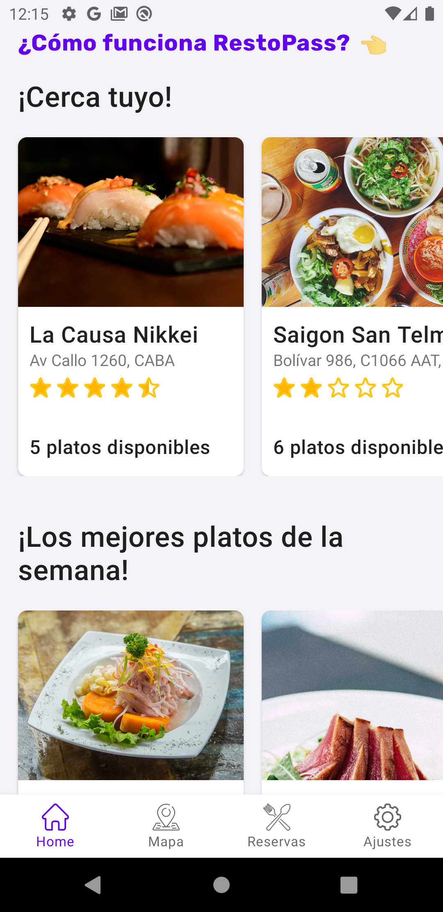

### Home usuario enrolado

    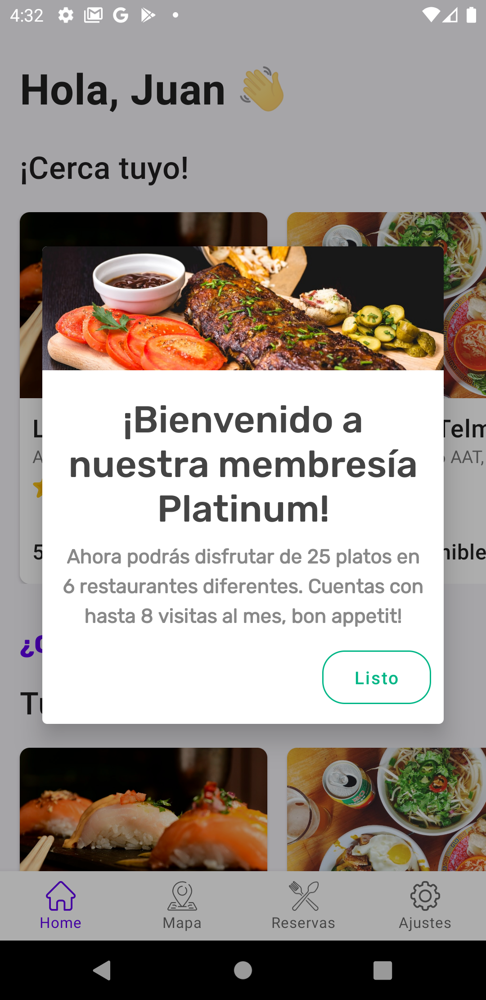
    
    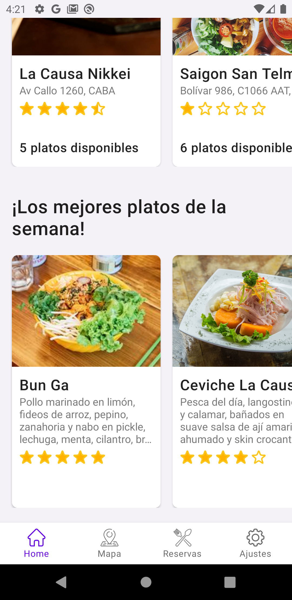

### Mapa

    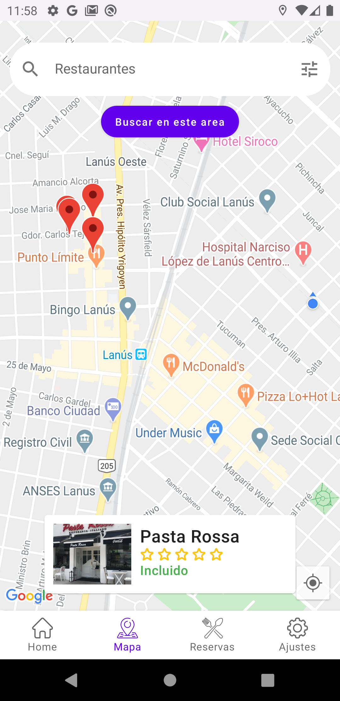
    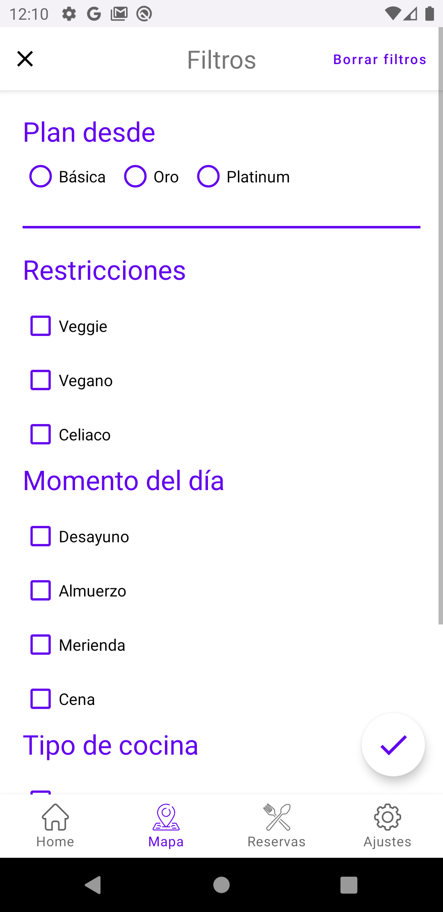

### Pantalla restaurante

### Pantalla de creación de reserva

    
    
    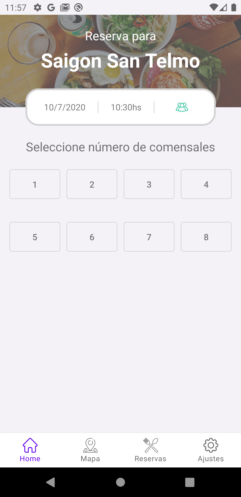
    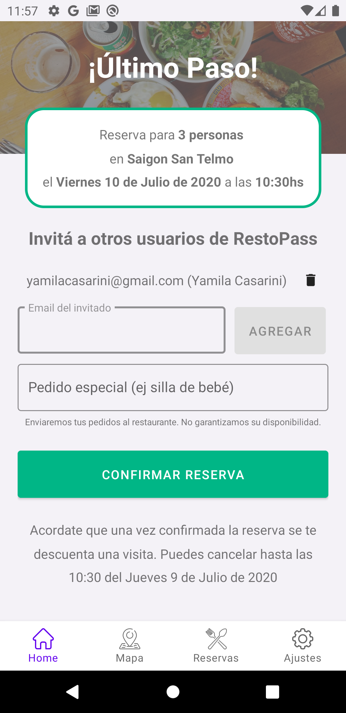
    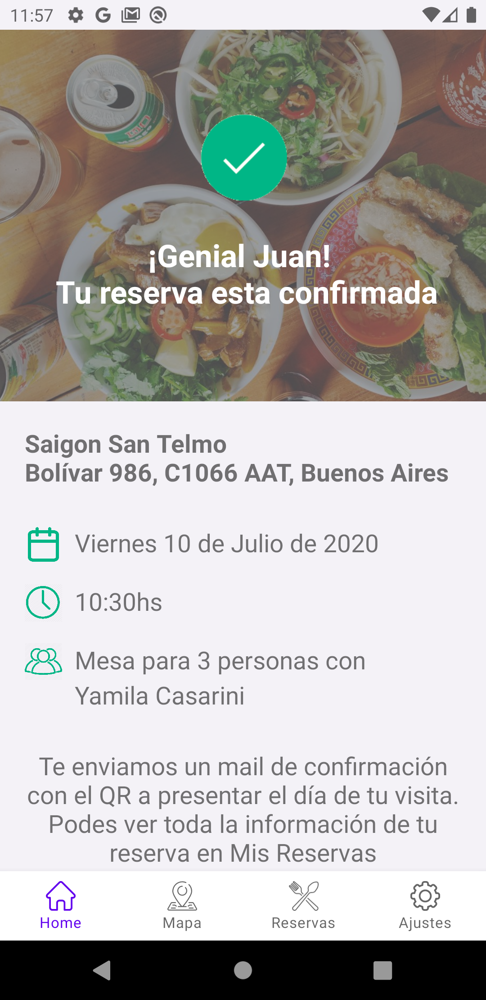

### Pantalla de reservas
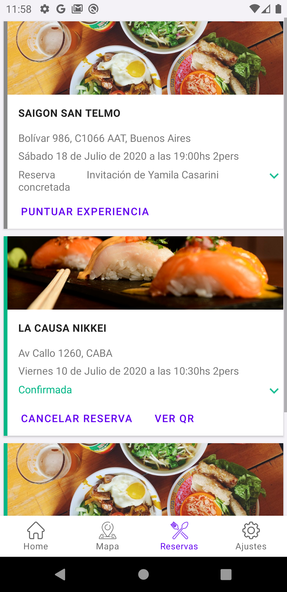

### Puntuación restaurante
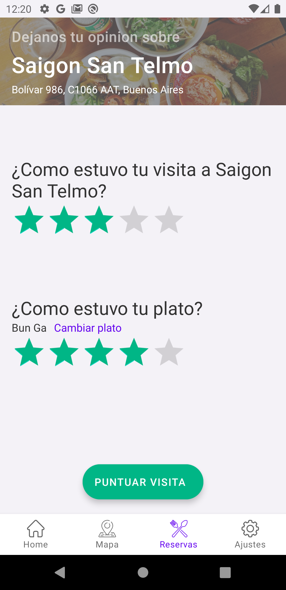

### Sección membresías

    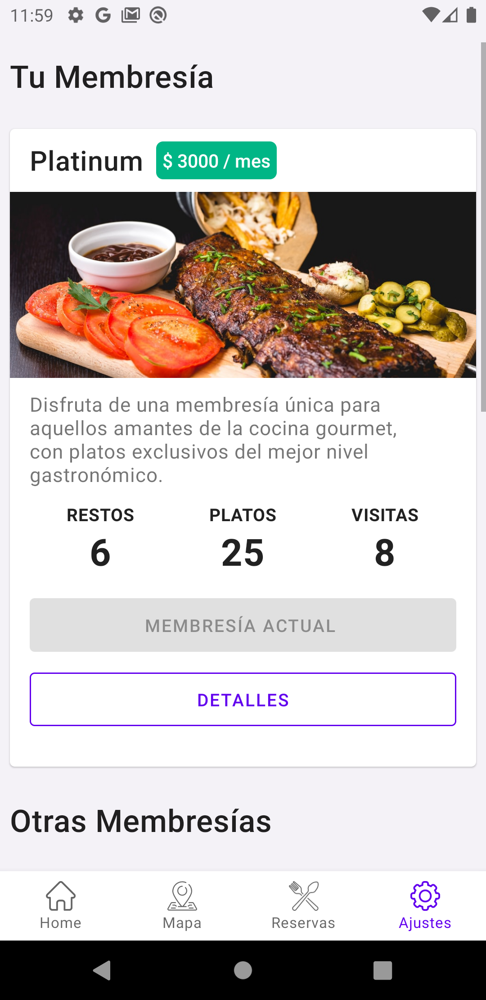
    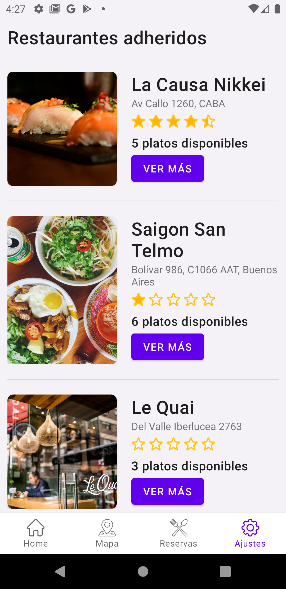

